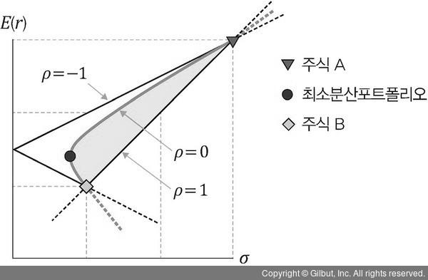

# Portfolio-with-Python

파이썬으로 배우는 포트폴리오 도서를 읽고 정리한 레포지토리입니다.

## 기록

* 포트폴리오 효과 : 포트폴리오를 구성해서 같은 기대수익률 하에 위험이 줄어드는 것
* 두 자산의 움직임이 반대로 갈 때, 즉, 상관관계가 -1에 가까울수록 분산 효과가 큼

 

* 포트폴리오를 평가하는 지표
  
  * 샤프지수 : 위험 한 단위를 감수할 때 얻을 수 있는 초과수익. 수익이므로 높을수록 좋음
  
  * 젠센알파지수 : 포트폴리오 수익률과 기대수익률의 차이. 시장 대비 얼마나 높은 성과를 냈는지 알 수 있으므로 높을수록 성공적인 투자였음을 의미. 기대수익률은 펀드가 추종하는 벤치마크지수로 볼 수 있음
  
  * 트레이너지수 : 위험보상비율. 샤프지수와 다른점은 분모를 수익률의 표준편차(총위험의 척도)가 아닌 베타(시장위험의 척도)를 사용하는것. 이는 포트폴리오 분산이 잘 이루어졌다면 개별 종목에 대한 비체계적 위험은 없어지고 시장의 위험만 존재한다고 가정하기 때문임. 이 또한 높을수록 성과가 좋음을 의미
  
  * 정보비율 : 초과수익를 리스크로 나눈 값. 위험조정 후 수익률이 수익률의 변동 혹은 위험에 노출된 대가로 달성된 것인지를 파악함
  
  * 최대 낙폭(MDD) : 특정 기간에서 고점에서 저점까지의 최대 누적 손실. 고점에서 차기 저점까지의 하락폭이 가장 큰 구간의 등락률로, 기존의 표준편차가 놓치기 쉬운 하락위험을 잘 설명함

 

* 평균-분산 포트폴리오 이론
  * 위험을 줄이고 수익률을 높이기 위해 상관계수가 낮은 자산을 결합해 최적 포트폴리오를 구성할 수 있음
  * 포트폴리오의 기대수익률 : 수익률*기대값
  * 포트폴리오의 위험 : (주식 A 투자비중^2) * (주식 A 분산) + (주식 B 투자비중^2) * (주식 B 분산) + 2 * 주식 A 투자비중 * 주식 B 투자비중 * 포트폴리오 공분산

* 최소분산포트폴리오
  
  * 
  
  * 가로축은 위험, 세로축은 이익
  
  * 상관계수가 -1일 때 포트폴리오가 만들어내는 조합의 좌표는 가장 윗쪽 직선상에 찍힘(optimal한 경우)
  
  * 상관계수가 1일 때 가장 아랫쪽 직선상에 찍임(worst)
  
  * 가능한 지점 중 위험도가 가장 낯아지는 부분이 최소분산포트폴리오 조합

* 포트폴리오 베타
  * 포트폴리오를 구성하는 자산의 수가 늘어날수록 리스크는 줄어들지만, 일정 수준 이하로는 내려가지 않음
  * 이처럼 제거할 수 없는, 시장 전체에 공통으로 미치는 체계적 위험(Systemic Risk)를 베타라고 함
  * 시장 수익률에 대한 민감도를 의미하며, 시장 수익률이 1% 변할 때 종목 수익률이 몇 % 변하는지 나타냄.
    * 베타가 1이면 시장과 같은 변동성을, 1보다 낮으면 시장에 둔감하게 움직임
  * 기대수익률과 마찬가지로 구성 자산 베타의 가중평균과 같음
  * 일반적으로 기술주의 베타는 1 이상이고, 경기방어주는 1 이하의 값을 가짐

* 샤프 비율 : 투자자가 부담하는 위험에 대해서 자산 수익률이 얼마나 잘 보상하는지에 대한 지표
  * 따라서 같은 기준지표로 두 자산을 비교하면, 높은 샤프 비율을 가진 자산이 더 효율적임
  * 최적의 포트폴리오는 샤프 비율이 가장 높은 포트폴리오로, 자본시장선과 효율적 포트폴리오 접선 위에 위치함

* 블랙-리터만 모델
  
  * 평균-분산 모델은 다수 자산에 투자 비중이 분배되지 않고 일부 자산에 과도하게 편중되는 경우가 잦음. 이는 기대수익률/위험 측정 오차가 최적화 단계에서 증폭되어 포트폴리오 투자 비중이 민감하게 반응하여 발생하는 현상
  * 블랙-리터만 모델은  베이즈 정리를 사용해 투자자의 견해를 고려하며, 자산을 시장가치에 비례해 투자함으로써 앞선 문제들을 해결했음
